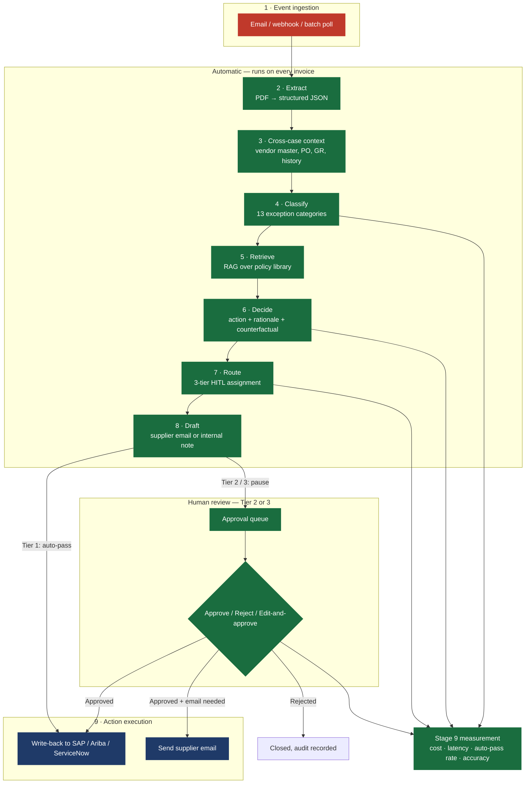
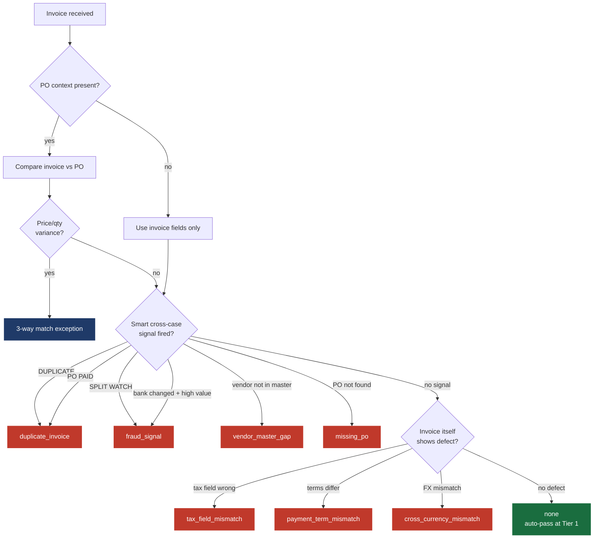
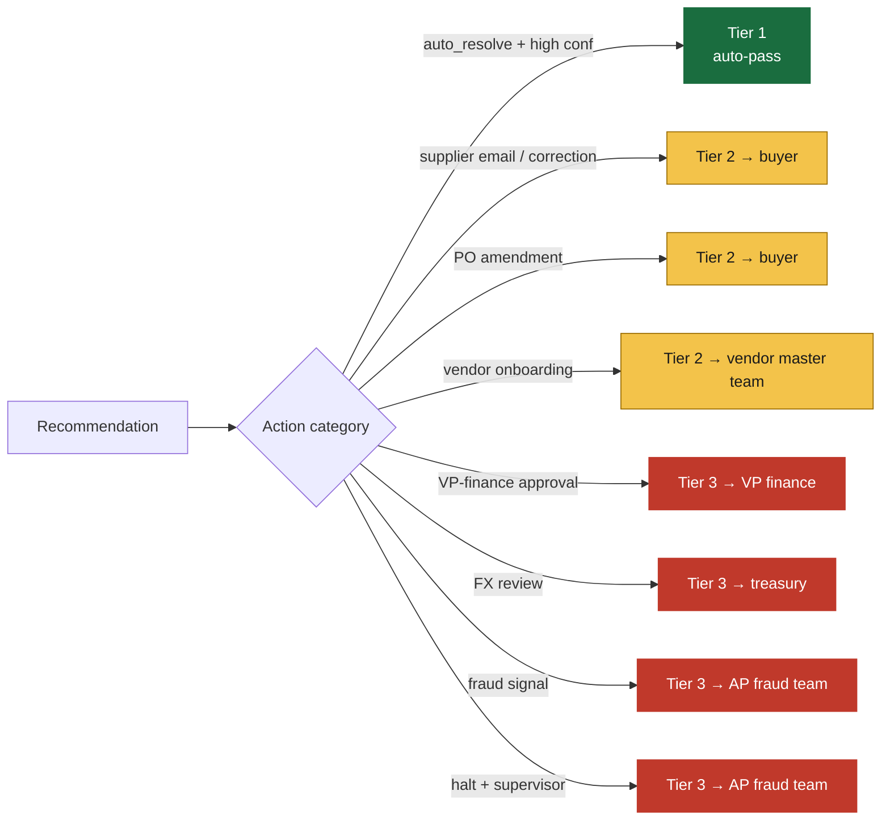

# Agent 1 — Architecture Diagram

Buyer-facing architecture diagram. Copy any block into a slide deck or Word doc — the Mermaid renders natively in GitHub, in many slide tools (e.g. Notion, Reflect), and via the [Mermaid Live Editor](https://mermaid.live/) for export to PNG/SVG.

Last updated: 2026-05-13 (Phase 9 — mock action executor live; all 9 logic nodes shipped).

---

## End-to-end pipeline (10 nodes)

The agent watches the buyer's P2P process and walks every exception through the same 10 steps. Steps 1–7 run automatically; step 8 pauses for a human if the routing tier is ≥ 2; step 9 (action executor) is gated on the human's call.



**Legend:** Green = shipped and tested with real LLM calls. Blue = shipped in mock mode (action executor — simulates downstream calls; real backend swaps in once SAP credentials arrive). Red = pending (event ingestion — gated on credentials too).

---

## Decision flow inside the classifier

The classifier is the source of "did we find an exception?" Its decision order is anchored on the invoice itself, with cross-case context as supplementary evidence.



---

## HITL tier routing



---

## Data flow — what's persisted where

```mermaid
flowchart LR
    PDF[Uploaded PDF] --> UP[logs/demo_uploads/{run_id}.pdf]
    LLM[Every LLM call] --> JSONL[logs/llm_calls.jsonl<br/>task, model, tokens, cost, latency]
    RUN[Pipeline run] --> RUNS[(SQLite — pipeline_runs)]
    HITL[Tier ≥ 2 case] --> ITEMS[(SQLite — hitl_items)]
    REVIEW[Approve / reject] --> AUDIT[(SQLite — hitl_audit_entries)]

    RUNS --> S9[Stage 9 dashboard]
    ITEMS --> S9
    JSONL --> S9

    classDef store fill:#1F3A68,stroke:#1F3A68,color:#fff;
    classDef sink fill:#1A6D3F,stroke:#1A6D3F,color:#fff;
    class UP,JSONL store
    class RUNS,ITEMS,AUDIT store
    class S9 sink
```

---

## Tech stack — locked decisions

| Layer | Choice | Why |
|---|---|---|
| Runtime LLM | DeepSeek V4-Flash via OpenRouter (default per task) | 90-95% cost savings vs Sonnet/GPT-4o at agent-quality |
| Reasoning LLM | DeepSeek R1 (decision-support) | Reasoning capability with cited rationale |
| Embedding | bge-large-en-v1.5 (local) | Free at runtime, portable to on-prem |
| Orchestration | Plain async + LangGraph wrap (deferred) | Single async function today; LangGraph swap-in mechanical |
| Domain models | pydantic v2 | Type safety, schema validation, JSON round-trip |
| State | SQLite (HITL queue + pipeline runs) | Zero config; Postgres swap via SQLAlchemy URL |
| Vector store | In-memory numpy cosine | Mock-content stage; pgvector for production |
| Web demo | FastAPI + Jinja + Chart.js | Real surface, no SPA overhead |
| Connectors | Stub today; SAP OData primary | Waiting on SAP credential email |

---

## What ships today vs what's pending

**Shipped (Phase 1–9):**
- Test corpus: 490 synthetic invoices + JSON sidecars
- 9 LLM/logic nodes end-to-end (extract → cross-case context → classify → retrieve → decide → route → draft → enqueue → mock execute)
- HITL approval queue at `/queue` with Approve / Reject / Edit-and-approve flow
- `/demo` upload flow + curated sample picker + full per-node trace at `/demo/run/{id}`
- Stage 9 measurement dashboard at `/stage9` (cost, latency, auto-pass rate, classification mix, HITL resolution)
- Mock action executor (16-action recipe map): SAP POSTs, email sends, ServiceNow tickets, HALT_PAY_RUN, PagerDuty NOTIFY, audit records
- 24 golden cases covering all 13 exception categories (including 3 anti-false-positive anchors)
- 80 unit + integration tests
- $3.74 total LLM spend across all phases

**Pending (gated on SAP credentials):**
- Event ingestion (node 1) — webhooks + batch polling from SAP / Ariba / ServiceNow / Email
- **Real** action execution backend — drop-in replacement for the mock executor
- Real SAP / Ariba / ServiceNow connector implementations

**Deferred until pilot:**
- LangGraph wrap of the async pipeline
- Postgres state persistence (SQLite is fine for solo / small)
- Auth / SSO on the demo console
- Quarterly Stage 9 exporter (CSV / PDF buyer reports)

---

## How to read this diagram in a buyer conversation

The line a buyer asks every time: "OK, but show me how the agent decides." Walk them through these in order:

1. **End-to-end pipeline.** Point at the 10 nodes. Stress steps 5 (RAG retrieval) and 9 (action execution) — those are where buyer-specific customization lives.
2. **Decision flow.** Open this diagram. The classifier doesn't guess — it follows a fixed decision order with explicit guardrails. Counter to LLM-hallucination fear.
3. **HITL tier routing.** Show all the Tier-3 lanes (fraud, treasury, VP finance). Stress that the agent never auto-acts on Tier 3.
4. **Data flow.** Show what's persisted. Buyer's compliance/risk team will care.
5. **Stage 9.** Open `/stage9` if the demo is live. The dashboard IS the recurring-revenue story.

---

*All diagrams above render natively in GitHub markdown preview. For decks, paste the Mermaid block into [mermaid.live](https://mermaid.live) and export as PNG.*
